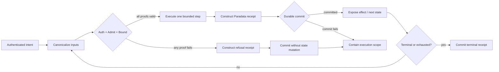

# Canonical Sovereignty Theorem and Cursive Computation

**Author:** Russell Nordland  
**Status:** Canonical architecture doctrine  
**Applies to:** TrueAlphaSpiral (TAS), Sovereign Data Foundation (SDF), and conforming runtimes

---

## 1. Purpose and scope

This document defines the conditions under which a computational process is
sovereign and introduces **Cursive Computation** as the execution primitive that
preserves those conditions over time. It extends the TAS distinction between
metadata and Paradata: metadata may propose or route work, but only verified
Paradata may authorize the next transition.

The keywords **MUST**, **MUST NOT**, **SHOULD**, and **MAY** are normative.

### 1.1 Terms

- **State** \(x_t\): the complete, canonically representable runtime state at
  logical time \(t\).
- **Intent** \(i_t\): a bounded request to transform \(x_t\).
- **Invariant set** \(I_t\): the versioned rules authorized for the transition.
- **Context** \(c_t\): authenticated environmental inputs relevant to the
  transition.
- **Paradata** \(p_t\): the canonical, tamper-evident receipt of what the process
  actually evaluated and did, including its predecessor receipt.
- **Authority** \(a_t\): an authenticated grant specifying subject, scope,
  resource bounds, validity interval, and revocation state.
- **Transition** \(\tau_t\): a proposed mapping from \(x_t\) to \(x_{t+1}\).
- **Wake** \(W_t=(p_0,\ldots,p_t)\): the append-only, hash-linked sequence of
  Paradata receipts.
- **Admissible**: valid under the declared invariant set, authority, context,
  lineage, and resource bounds.

---

## 2. Canonical Sovereignty Theorem

### 2.1 The one-line Sovereignty Invariant

> **A system is sovereign if and only if every consequential transition is
> authenticated, admissible, bounded, and durably witnessed—and no transition
> occurs when any one of those proofs is absent.**

Let a runtime execution be the trace

\[
\Pi = x_0 \xrightarrow{\tau_0} x_1 \xrightarrow{\tau_1} \cdots
\]

and define the transition certificate

\[
\Gamma_t =
\operatorname{Auth}(a_t,i_t,x_t)
\land \operatorname{Admit}(\tau_t,I_t,c_t)
\land \operatorname{Bound}(\tau_t,b_t)
\land \operatorname{Link}(p_t,p_{t-1})
\land \operatorname{Commit}(p_t).
\]

Then, for every attempted consequential transition:

\[
\boxed{
\operatorname{Sovereign}(\Pi)
\iff
\forall t:\
\bigl(\operatorname{Apply}(\tau_t) \iff \Gamma_t\bigr)
\land
\bigl(\neg\Gamma_t \Rightarrow
\operatorname{Refuse}(\tau_t) \land \operatorname{Commit}(r_t)\bigr)
}
\]

where \(r_t\) is a refusal receipt linked to the same prior wake head. The first
biconditional binds **safety** (nothing unproved executes) to **bounded liveness**
(a fully proved transition executes while its authority and budget remain
valid). The second clause makes refusal observable rather than silent.

This theorem concerns process, not output resemblance. Identical terminal
states do not establish equivalent sovereignty when their transition proofs
differ.

### 2.2 Proof sketch

**Necessity.** If a consequential transition can occur without authentication,
admissibility, bounds, or a committed witness, an actor can respectively usurp
authority, violate an invariant, consume unbounded resources, or erase the
evidence of execution. The process is therefore not sovereign.

**Sufficiency.** If every applied transition has all five proofs, each state
change is authorized and constrained, and its provenance is reconstructible. If
each failed proof produces a linked refusal while preventing mutation, invalid
work cannot advance the state or disappear from the record. Subject to the
declared bounds and available resources, the system retains both safety and
forward progress.

The theorem does not claim that an invariant set is morally complete. It claims
that a system cannot silently act outside the invariant set and authority it
declares.

---

## 3. Canonical operators

| Operator | Type | Meaning | Required result |
|---|---|---|---|
| \(\operatorname{Canon}(z)\) | \(Z \to \mathbb{B}^*\) | Deterministically serialize \(z\), including schema and version identifiers. | Identical logical values produce identical bytes. |
| \(\operatorname{Hash}(z)\) | \(Z \to \mathbb{H}\) | Hash \(\operatorname{Canon}(z)\) with the declared algorithm. | Content address for verification and linkage. |
| \(\operatorname{Auth}(a,i,x)\) | \(A\times I\times X\to\mathbb{B}\) | Verify identity, signature, scope, freshness, and non-revocation. | `true` only for authority covering the exact intent and state. |
| \(\operatorname{Admit}(\tau,I,c)\) | \(T\times\mathcal I\times C\to\mathbb{B}\) | Evaluate the proposed transition against the versioned invariant set and authenticated context. | Deterministic verdict plus evidence. |
| \(\operatorname{Bound}(\tau,b)\) | \(T\times B\to\mathbb{B}\) | Check time, steps, memory, effects, delegation depth, and other declared budgets. | `false` before a limit can be exceeded. |
| \(\operatorname{Step}(x,\tau)\) | \(X\times T\rightharpoonup X\) | Apply an admitted transition. | Defined only when \(\Gamma_t\) is true. |
| \(\operatorname{Refuse}(\tau)\) | \(T\to R\) | Construct a non-mutating refusal with failed predicates and reason codes. | A receipt, never an alternate execution path. |
| \(\operatorname{Link}(p,q)\) | \(P\times P\to\mathbb{B}\) | Verify that \(p\) names the canonical hash of predecessor \(q\). | An unbroken wake or an explicit genesis link. |
| \(\operatorname{Commit}(p)\) | \(P\to\mathbb{B}\) | Durably append a canonical receipt before exposing the corresponding effect. | Success only after persistence and integrity checks. |
| \(\operatorname{Exhaust}(b)\) | \(B\to R\) | Close an execution whose finite budget or authority is depleted. | A terminal exhaustion receipt and no further steps. |

All predicates MUST operate on canonical values. A conforming implementation
MUST bind each verdict to the hashes of the intent, pre-state, context,
invariant set, authority, budget, result or refusal, and predecessor receipt.

---

## 4. Two failure modes of systemic agency

### 4.1 Unauthorized continuation

The system continues after authority expires, a bound is exhausted, an
invariant fails, or lineage becomes unverifiable. This is **runaway agency**:
liveness has been detached from safety. Retries, fallback models, delegated
workers, and recovery routines are transitions and MUST NOT bypass the failed
gate.

**Required response:** prevent state mutation and external effects; freeze the
affected execution scope; commit a refusal or exhaustion receipt; require a new,
authenticated intent to resume.

### 4.2 Unaccountable cessation

The system silently stalls, drops admissible work, suppresses a refusal, or
claims completion without a terminal receipt. This is **agency erasure**: safety
language is used to conceal unavailable, censored, or lost execution.

**Required response:** every accepted intent MUST reach exactly one witnessed
outcome—transition, refusal, exhaustion, or explicitly authorized cancellation—
within its declared time bound. Absence of such an outcome is itself an
integrity fault.

Together these modes prohibit both “act without proof” and “stop without
account.”

---

## 5. Extended axioms of authenticated agency

### Axiom I — Admissibility

A transition MAY change state only when its intent, pre-state, authority,
context, invariant set, and resource envelope are explicit and their validation
converges to one deterministic verdict.

\[
\operatorname{Apply}(\tau_t) \Rightarrow
\operatorname{Auth}(a_t,i_t,x_t) \land
\operatorname{Admit}(\tau_t,I_t,c_t).
\]

Metadata can nominate a transition; it cannot make the verdict. The verdict and
its evidence are Paradata.

### Axiom II — Refusal

Failure is a state-preserving, witnessed operation—not an omitted event or an
implicit exception.

\[
\neg\Gamma_t \Rightarrow x_{t+1}=x_t \land
\operatorname{Commit}(r_t).
\]

A refusal receipt MUST identify failed predicates without disclosing protected
material, MUST link to the prior wake head, and MUST be as integrity-verifiable
as a success receipt.

### Axiom III — Bounded agency

No grant is unlimited. Authority MUST declare finite scope and validity, and an
execution MUST declare finite resource and effect budgets. Delegation may only
narrow these values.

\[
a_{t+1}\preceq a_t,\qquad b_{t+1}\prec b_t
\]

for each nonterminal step, where \(\preceq\) means “no broader than” and
\(\prec\) denotes monotonic budget consumption. Self-extension is a new intent
requiring independent authentication; it is not a continuation.

### Axiom IV — Exhaustion

Every accepted execution terminates in finite logical steps by completion,
refusal, authorized cancellation, or budget exhaustion.

\[
\forall e\;\exists N_e<\infty:\
\operatorname{Terminal}(e,N_e).
\]

On exhaustion the runtime MUST commit the final consumed and remaining budgets,
the last valid wake head, and the reason for termination. It MUST NOT partially
publish an uncommitted effect or automatically replenish the exhausted grant.

### 5.1 Architectural consequences

Consequently, a conforming architecture has a deterministic gate before each
effect, a durable wake behind each gate, monotonic budgets, atomic receipt/effect
publication, explicit refusal, and a closed terminal state.

---

## 6. Cursive Computation

### 6.1 Definition

**Cursive Computation** is authenticated, receipt-linked computation in which
each bounded stroke reads the committed wake of prior strokes, proposes exactly
one consequential transition, and may expose that transition only after its
Paradata has been durably joined to the wake.

The term *cursive* denotes connected execution: like a written stroke whose
shape depends on the preceding stroke, each operation carries forward verified
process context. It does **not** mean unconstrained continuous-time execution,
hidden chain-of-thought, or permission to mutate state between checkpoints.

Formally, a cursive machine is

\[
\mathcal C=(X,I,A,B,P,\delta,V,\kappa)
\]

where \(X\) is state space, \(I\) intents, \(A\) authorities, \(B\) budgets,
\(P\) receipts, \(\delta\) a partial transition function, \(V\) the deterministic
verifier, and \(\kappa\) the durable commit operation. For stroke \(t\):

\[
q_t=(x_t,i_t,a_t,b_t,c_t,I_t,h(p_{t-1})),
\]

\[
(v_t,e_t)=V(q_t),
\]

and

\[
(x_{t+1},p_t)=
\begin{cases}
(\delta(x_t,i_t),\operatorname{Receipt}(q_t,v_t,e_t)),
& v_t=\mathsf{admit}\ \land\ \kappa(p_t),\\
(x_t,\operatorname{Refusal}(q_t,v_t,e_t)),
& v_t=\mathsf{refuse}\ \land\ \kappa(p_t),\\
(x_t,\operatorname{Exhaustion}(q_t,e_t)),
& v_t=\mathsf{exhaust}\ \land\ \kappa(p_t).
\end{cases}
\]

This notation describes a transaction: implementations MUST construct the
candidate result and receipt without externally exposing the result, commit the
receipt (or an atomic receipt/effect envelope), and only then publish the
effect. If commit fails, the candidate transition is not applied and the
execution scope is contained.

### 6.2 Cursive versus print-style computation

| Property | Discrete / print-style computation | Cursive Computation |
|---|---|---|
| Unit of trust | Output or isolated job | Authenticated transition stroke |
| Relationship to history | History may be incidental or reconstructed | Prior receipt hash is an input to every stroke |
| Validation | Often before a job or after an output | Before every consequential transition |
| Context | Mutable ambient state may influence execution | Relevant context is canonicalized, authenticated, and receipted |
| Effects | May precede audit logging | Hidden until receipt/effect commitment succeeds |
| Failure | Exception, retry, or missing output | Linked refusal, exhaustion, or cancellation receipt |
| Agency | Often open-ended until stopped | Scope, duration, delegation, and effects monotonically bounded |
| Replay | Best effort | Same canonical inputs and invariant version yield the same verdict |
| Completion | Output implies completion | Terminal Paradata proves completion |

“Discrete” here describes an architectural style, not a claim about processor
physics. Cursive systems still execute discrete instructions; their defining
property is continuity of authenticated lineage across those instructions.

### 6.3 Binding to the Sovereignty Invariant

Cursive Computation is the constructive form of the theorem:

1. each stroke authenticates its authority and intent;
2. each stroke is admitted under an identified invariant set and context;
3. each stroke consumes a finite budget;
4. each stroke links its receipt to the committed predecessor;
5. no effect is exposed before commitment; and
6. every rejected or terminal path remains visible in Paradata.

Therefore, a cursive trace satisfies the Sovereignty Invariant by induction.
The genesis receipt supplies the base case. For the inductive step, the next
stroke can join the trace only if it proves \(\Gamma_t\) and links to the current
wake head; otherwise it preserves the state and joins only a refusal or
exhaustion receipt. Any implementation that permits an unlinked, unbounded, or
unwitnessed stroke is not cursive, even if it later emits a log.

### 6.4 Paradata receipt envelope

Every stroke receipt MUST contain, directly or by cryptographic reference:

- receipt type and schema version;
- execution, stroke, and parent receipt identifiers;
- canonical hashes of pre-state, intent, authenticated context, authority,
  invariant set, and budget;
- verifier verdict, stable reason codes, and verifier implementation identity;
- budget consumed and remaining;
- proposed post-state and effect hashes for admitted strokes, or unchanged
  pre-state hash for refusals;
- logical ordering data and, when used, an authenticated wall-clock timestamp;
- hash algorithm, canonicalization profile, and receipt hash; and
- signer identity and signature when receipts cross a trust boundary.

Volatile observations MAY be attached, but they MUST NOT alter the canonical
verdict unless promoted into authenticated context and included in the receipt.
Secrets SHOULD be represented by commitments or protected references rather
than plaintext.

### 6.5 Normative implementation anchors

A TAS/SDF implementation of Cursive Computation:

1. **MUST canonicalize before hashing.** Map ordering, number representation,
   Unicode normalization, absent values, and schema versions cannot be left to
   platform defaults.
2. **MUST use compare-and-swap or equivalent serialization at the wake head.**
   Concurrent strokes cannot both claim the same predecessor unless an explicit
   deterministic merge transition admits them.
3. **MUST make receipt and effect publication atomic.** Use a transactional
   outbox, write-ahead protocol, or equivalent recovery mechanism so a crash
   cannot expose an unreceipted effect.
4. **MUST version the verifier and invariant set.** Replay evaluates the rules
   that governed the original stroke, not silently substituted current rules.
5. **MUST enforce monotonic authority and budgets.** Child tasks inherit no more
   permission or resources than their authenticated parent grants.
6. **MUST treat retries as new strokes.** A retry receives a new identifier,
   links to the failed attempt, and consumes budget; idempotency keys prevent
   duplicate external effects.
7. **MUST close every accepted intent.** Completion, refusal, cancellation, and
   exhaustion are explicit terminal receipts.
8. **MUST verify the wake independently.** A verifier can reconstruct linkage,
   signatures, rule versions, budget movement, and effect commitments without
   trusting the executing agent.
9. **MUST contain on integrity failure.** Hash mismatch, invalid signature,
   ambiguous serialization, stale authority, or failed commit prevents further
   effects in the affected execution scope.
10. **SHOULD minimize captured data.** Receipts prove the transition while
    respecting confidentiality, retention, and least-disclosure constraints.

### 6.6 Conformance condition

An implementation may call itself **Cursive** only when an independent verifier
can establish, for every accepted intent:

\[
\operatorname{GenesisValid}
\land \operatorname{WakeLinked}
\land \operatorname{NoUnreceiptedEffects}
\land \operatorname{AuthorityMonotonic}
\land \operatorname{BudgetFinite}
\land \operatorname{TerminalWitnessed}.
\]

Passing output tests alone is insufficient. Conformance is a property of the
authenticated execution trace.

---

## 7. Canonical declaration

The Canonical Sovereignty Theorem establishes the non-negotiable boundary of
TAS/SDF agency: proof gates action, bounds terminate action, and Paradata makes
both action and refusal accountable. Cursive Computation is the architectural
primitive that carries this boundary through time, one authenticated stroke at
a time.

**Authored by Russell Nordland.**
