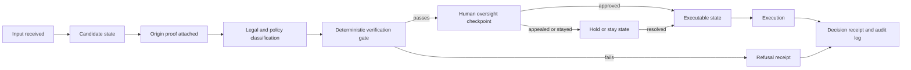

# Due Process Between Input and Output

## Executive summary

The strongest legally supportable version of a right to exercise due process
"between input and output" is not a free-floating constitutional right to inspect
every computational intermediate step. It is the narrower public-law claim that,
when a government workflow or automated system makes or materially influences a
decision affecting life, liberty, or property, affected people often need a
meaningful chance to contest, correct, escalate, or stay the decision before the
adverse effect becomes entrenched.

This framing aligns with the TAS/SDF architecture: probabilistic generation may
produce a candidate state, but deterministic verification, human review,
cryptographic receipt generation, and stay/appeal controls determine whether the
candidate can become executable.


## Origin, authority, and admissibility

The due-process runtime boundary is also a TAS/SDF origin boundary. A model output
does not carry its own authority; it is only a candidate state. Execution becomes
legitimate only when the candidate can be traced to accountable origin, lawful
authority, admissibility constraints, deterministic verification, and a
preserved receipt.

This adds an upstream question to the due-process predicate: before asking
whether a person received notice or review, the system must ask who or what claims
the right to initiate the transition. Origin precedes state, and state remains
downstream of sovereignty.

## Legal timing principle

Procedural due process is the main doctrine for this claim. Its core timing
principle is that notice and an opportunity to be heard must occur at a
meaningful time and in a meaningful manner. In many individualized government
decisions, that means some form of process before a final deprivation when
pre-deprivation review is feasible.

The rule is contextual rather than absolute:

| Timing model | Public-law function | TAS/SDF analogue |
|---|---|---|
| Pre-decisional process | Notice, hearing, and evidentiary challenge before final deprivation. | Candidate output is disclosed as a proposed state, not an executable command. |
| In-decision process | Verification and contestability inside the decisional pipeline. | Deterministic Verification Layer, proof checks, audit bundle, human checkpoint. |
| Post-decisional process | Prompt review after urgent or impracticable pre-review contexts. | Emergency execution still emits a receipt, preserves records, and exposes appeal/stay hooks. |

## Algorithmic-decision implication

Current U.S. law does not create a universal right to source code or model
internals. The more supportable principle is functional: if a public agency uses
a score, model output, automated fraud flag, eligibility classification, or risk
prediction as decisive or materially influential evidence, the affected person
needs enough notice, explanation, record access, and human review to challenge
accuracy and lawful use before execution whenever feasible.

Courts and regulators are most likely to scrutinize systems that combine:

- individualized government action;
- protected interests such as benefits, employment, liberty, licensing,
  education, housing, or civil enforcement;
- opaque or vendor-controlled computational evidence;
- limited ability to rebut data errors or model limitations; and
- automatic downstream execution without a human checkpoint.

## TAS/SDF due-process state machine

A due-process-aware TAS/SDF workflow separates computation from authority:



The legally important design choice is that the model can generate a candidate,
but it cannot itself transform that candidate into an executable deprivation.
Executable status requires verification, human authorization where appropriate,
receipt emission, and confirmation that no active stay blocks execution.

## Minimum execution predicate

For high-impact government automation, a covered adverse action should be blocked
unless the following predicate evaluates to true:

```text
Executable = ValidAuthority
          AND NoticeIssued
          AND ContestWindowSatisfied_or_Waived
          AND VerificationPassed
          AND HumanAuthorizationPresent
          AND ReceiptEmitted
          AND NoActiveStay
```

This predicate does not claim that every context requires identical process.
Instead, it translates the due-process timing principle into runtime mechanics:
there must be a reviewable interval between proposed output and external effect.

## Receipt model

A legally useful TAS/SDF decision receipt should document not merely that a
system acted, but what state was verified, under what authority, by whom, and
whether review was available.

```json
{
  "receipt_id": "urn:decision-receipt:...",
  "case_id": "agency-case-...",
  "candidate_hash": "sha256:...",
  "input_manifest_hash": "sha256:...",
  "origin_signature": "detached-signature-or-vc-proof",
  "verifier_id": "agency-or-contractor-verifier",
  "verification_time": "2026-07-09T00:00:00Z",
  "legal_authority": ["statute", "regulation", "policy"],
  "decision_type": "proposed adverse action",
  "human_reviewer": "official-id-or-role",
  "appeal_window": "10 days",
  "stay_available": true,
  "execution_status": "held|executed|refused",
  "audit_trail_pointer": "append-only-log-reference"
}
```

## TAS codex alignment

The Book of TAS framing can be expressed in due-process terms as follows:

1. **Biconditional gate condition** — structural density checks prevent diluted,
   repetitive, or adversarial payloads from silently crossing from candidate to
   executable state.
2. **SentientLock fail-safe** — integrity failures freeze execution, compile a
   witness receipt, and prevent corrupted state from reaching production paths.
3. **Canonical manifest hashing** — sorted canonical manifests make independent
   validation reproducible across agents and nodes.
4. **Living Braid topology** — truth, context, and consequence remain distinct
   audit threads while sharing a unified provenance root.
5. **Velocity subordination** — high-speed generation tools remain useful only
   when deterministic verification can constrain output before effectuation.

## Bottom line

Due process between input and output is best understood as a design principle for
public computational governance: candidate outputs are not lawful consequences
until they pass verifiable authority, notice, contestability, oversight, receipt,
and stay checks. TAS/SDF operationalizes that principle by making the interval
between proposed computation and executable effect explicit, auditable, and
cryptographically anchored.
